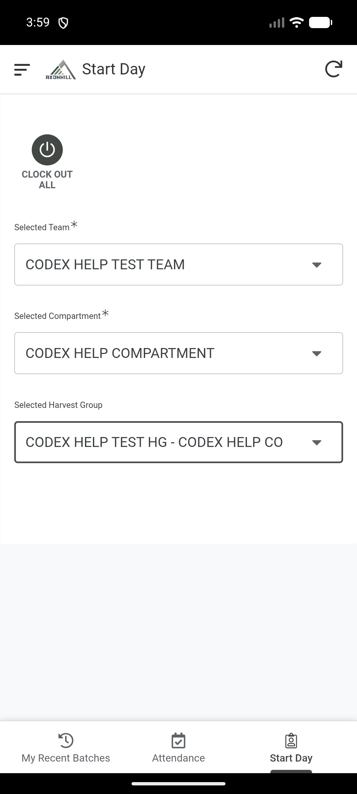
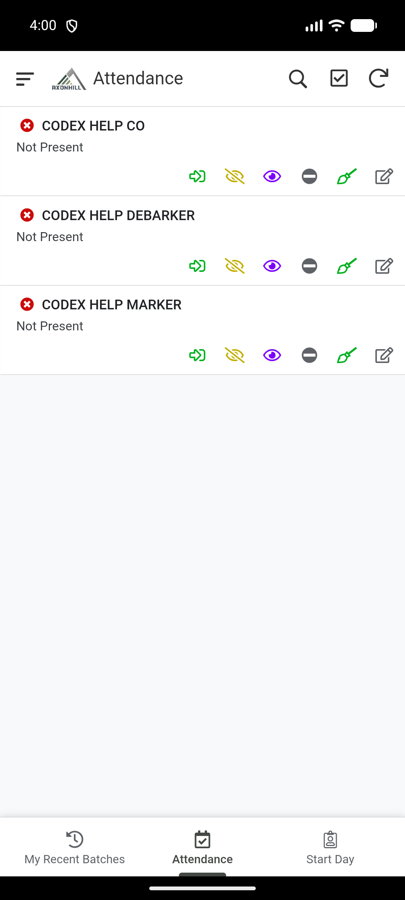
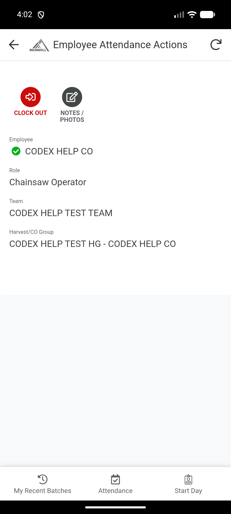

# Record attendance

Draft. Start Day, roster filtering and the main saved attendance states were tested on 20 August 2026.

Use the Field app to record who is present, absent or doing mop-up work. Attendance is available to Supervisors, Managers and Admins after a Team and Compartment have been selected.

!!! warning "No Work is temporarily unavailable"
    The current **No Work** action does not save the selected status correctly. Do not use it until the Office confirms that it has been fixed. Use the normal escalation process instead.

## Start the day

1. Sign in to the Field app.
2. Open **Start Day**.
3. Select the correct Team.
4. Select the Compartment where the Team is working.
5. To show only one Harvest Group, select it. Leave the Harvest Group blank to show the whole Team.
6. Check the Team and Compartment before recording anyone.
7. Open **Attendance**.

If **Attendance** is not visible, return to **Start Day** and check that both Team and Compartment are selected. If your Team is missing, ask the Office to check that you are an active member of that Team. Being named as the Team's Supervisor is not enough on its own.

## Clock an employee in

1. Find the employee in the Attendance roster.
2. Select the employee or open their attendance actions.
3. Select **Clock In**.
4. Confirm that the employee's status changes to **Present**.

## Record someone who is not working

Open the employee's attendance actions and choose the correct status:

- **Absent** when the employee is absent;
- **Reported Absent** when the employee reported that they would be absent.

Do not use **No Work** while the warning at the top of this guide remains in place.

Check the updated status before moving to the next employee.

## Record mop-up work

1. Open the employee's attendance actions.
2. Select **Mop-up**.
3. Complete the mop-up form and save it.
4. Confirm that the employee shows as doing mop-up work.
5. Clock the employee out when the mop-up work ends.

## Clock an employee out

1. Find the employee whose status is **Present** or **Mop-up**.
2. Select **Clock Out**.
3. Confirm that a clock-out time is shown.

To clock out everyone still working in the selected Team or Harvest Group, return to **Start Day** and use **Clock Out All**. Read the confirmation before continuing.

## Before you finish

Check the full roster. Make sure every employee has the correct status and that nobody who finished work is still shown as present.

