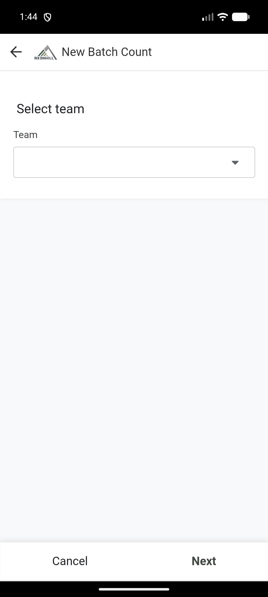
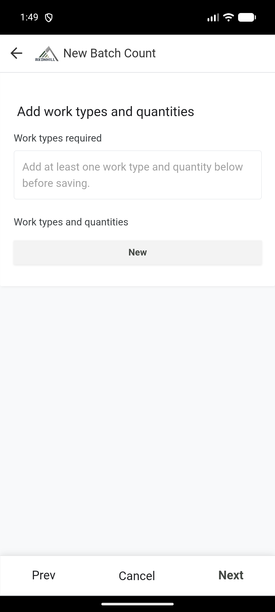

# Submit a batch harvest count

Checked in the Field app on 20 August 2026. A controlled batch completed and created the expected work records.

Use **New Batch Count** when one submission has one crew and one or more work types and quantities.

## Before you start

Have these ready:

- the team;
- the compartment;
- the Harvest Group;
- the people who did the work;
- each work type and quantity;
- any notes or photos.

## Enter the count

1. Open the Field app.
2. Select **New Batch Count**.
3. On **Select team**, choose the correct team. Select **Next**.

4. Choose the compartment. Select **Next**.
5. Choose the Harvest Group. Select **Next**.
6. Check the chainsaw operator, markers and debarkers shown for the group.
7. If another chainsaw operator stood in, select **Different Chainsaw Operator than on Harvest Group name?**, then choose that person.
8. Select **Next**.

## Add work types and quantities

1. On **Add work types and quantities**, select **New**.

2. Choose the work type.
3. Enter the quantity and any other required count details.
4. Save the line.
5. Add another line if the crew did another type of work.
6. Check that every line is correct, then select **Next**.

You must add at least one work type and quantity.

The final verification text can be dense on a small screen. Read each employee, work type and quantity carefully before choosing **Y**.

## Add notes and proof

1. Add a note when it will help the office understand the count.
2. To add a photo, select **New** below the photo section and upload the correct photo.
3. Check the location if it is shown.
4. Select **Next** or **Save**, as shown.

## Verify before saving

1. Read the employee names, work types and quantities shown in the verification question.
2. Ask the employee to confirm that they are correct.
3. Record the **Y** response only when the details are correct.
4. Add the verifier's signature when required.
5. Select **Save** once.
6. Keep the app open while it syncs and processes the batch.

## Check the result

Open **My Recent Batches**. The batch may first show **Draft** or **Processing**. It should move to **Completed** after the automation finishes.

If it shows **Partial error**, **Rejected** or **Error**, open it and read the message. Do not submit the batch again. Send its ID and the exact message to the Office.
