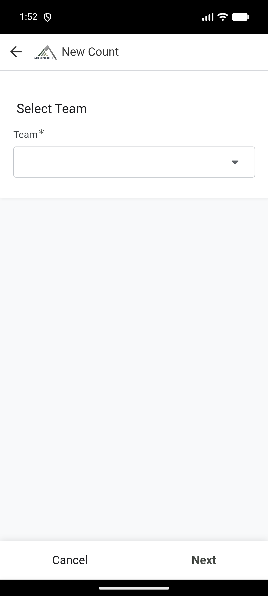
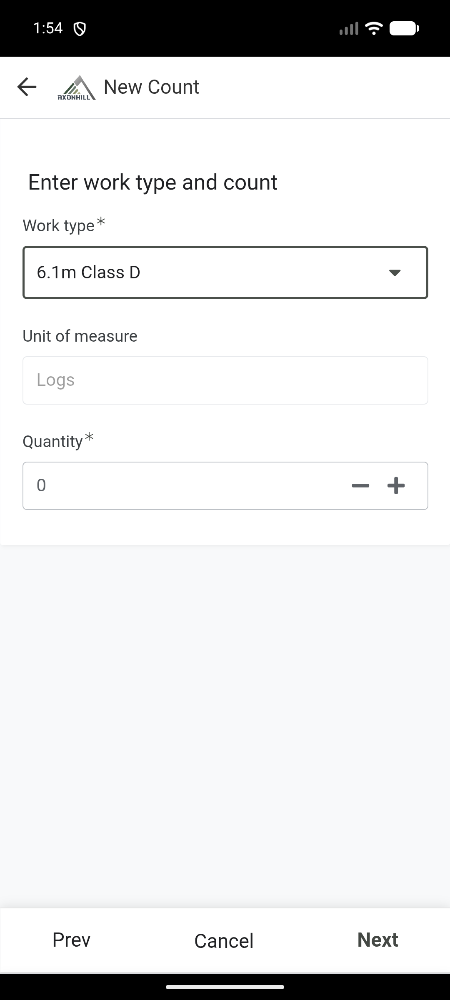

# Submit a harvest count

Draft. A controlled count was saved on 20 August 2026, but it could not finish processing because its work type was blank.

Use **New Count** to record one work type and quantity for a selected Team, Compartment and Harvest Group.

!!! warning "Do not save without a work type"
    The current form may show Quantity without showing a Work type field. If you cannot see and select a work type, cancel the count and tell the Office. Saving it will leave the count stuck and no Worklogs will be created.

## Before you start

Have these ready:

- the Team;
- the Compartment;
- the Harvest Group;
- the people who did the work;
- the work type and quantity;
- any notes or proof photos.

## Enter the count

1. Open the Field app.
2. Select **New Count**.
3. On the Team page, choose the correct Team. Select **Next**.

4. Choose the correct Compartment. Select **Next**.

5. On **Select group and/or stripper**, choose the Harvest Group.

6. Check the chainsaw operator, markers and debarker shown for the group.
7. If another chainsaw operator stood in, select **Different Chainsaw Operator than on Harvest Group name?**, then choose that person.
8. Select **Next**.

## Add the work and quantity

1. Choose the work type.
2. Enter the quantity and any other required count details.
3. Check the unit of measure.
4. Select **Next**.

## Add notes and proof

1. Add a note when it will help the office understand the count.
2. To add a photo, select **New** below the photo section and upload the correct photo.
3. Check the location if it is shown.
4. Select **Next**.

## Verify and save

1. Read the employee names, work type and quantity shown in the verification question.
2. Ask the employee to confirm that they are correct.
3. Record the **Y** response only when the details are correct.
4. Add the verifier's signature when required.
5. Select **Save** once.
6. Keep the app open until it finishes syncing.

## Check the result

Open **My Recent Entries** and select the new count. Confirm that the Team, Compartment, Harvest Group, people, work type and quantity match what was submitted.

If the work type is blank, processing stays Pending or an error is returned. Do not submit a second copy. Report the incorrect entry and its ID to the Office first.
