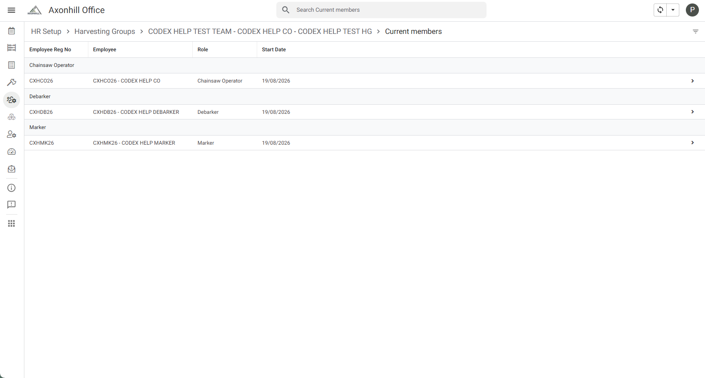

# Change a Harvest Group member role

Verified with a controlled Marker-to-Debarker change in an isolated test Harvest Group on 19 August 2026.

Use this when a current Harvest Group member must do a different role.

## Steps

1. Open the Office app.
2. Open **HR Setup**.
3. Open **Harvesting Groups**.
4. Open the required group.
5. In **Members**, open the row for the correct employee.
6. Select **Edit Member(s)**.
7. Check that **Request Type** is **Change Harvest Group Role**.
8. Check the employee, Harvest Group and current role.
9. Under **With this role**, choose the new role.
10. Choose the effective date.
11. Add a short note if it will help explain the change.
12. Select **Save** once.

## Check the result

1. Wait for the app to sync.
2. Open the Harvest Group again.
3. Check that the employee's current membership shows the new role.

Open **Full membership history** if you need to confirm the change. The old role remains as an ended row and the new role appears as active.

If the old and new roles both look current, do not make another request. Report it to the administrator.
