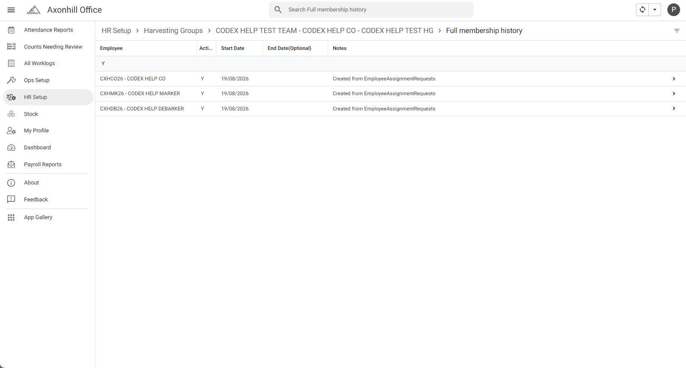

# View full Harvest Group membership history

The route and group filter are verified. A controlled ended-membership result still needs final confirmation.

Use this to check both current and previous Harvest Group assignments.

## Steps

1. Open the Office app.
2. Open **HR Setup**.
3. Open **Harvesting Groups**.
4. Open the required Harvest Group.
5. Select **Full membership history**.
6. Use **Active**, **Start Date** and **End Date** to understand each assignment.

An active row is marked **Y**. An ended assignment should remain here with its end date, even though it no longer appears under **Current members**.

For normal daily checks, use **Current members**. Do not change an old row merely to make the history look cleaner.
