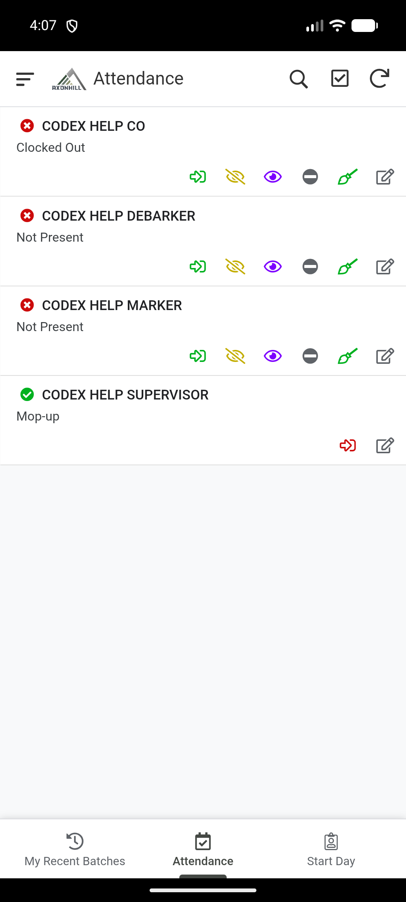
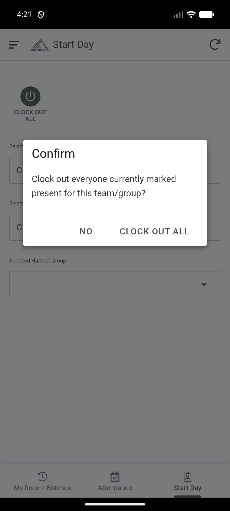
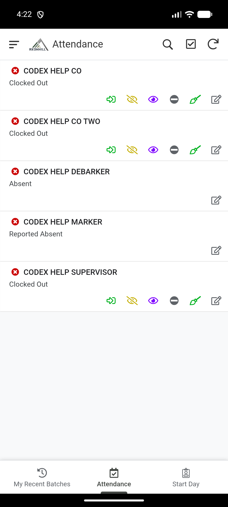

# Rekhoda i-attendance

Kuhlolwe ku-Field app nakwi-workbook ngo-20 kuya ku-21 Agasti 2026.

Sebenzisa i-Field app ukurekhoda ukuthi ubani okhona, ongekho noma owenza i-mop-up. I-Attendance itholakala ku-Supervisor, Manager noma Admin ngemva kokukhetha i-Team ne-Compartment.

## Qala usuku

1. Ngena ku-Field app.
2. Vula **Start Day**.
3. Khetha i-Team efanele.
4. Khetha i-Compartment lapho i-Team isebenza khona.
5. Uma ufuna ukubona i-Harvest Group eyodwa kuphela, yikhethe. Shiya i-Harvest Group ingenalutho ukuze ubone yonke i-Team.
6. Hlola i-Team ne-Compartment ngaphambi kokurekhoda umuntu.
7. Vula **Attendance**.

Uma **Attendance** ingabonakali, buyela ku-**Start Day** uhlole ukuthi i-Team ne-Compartment kukhethiwe. Uma i-Team yakho ingekho, cela ihhovisi lihlole ukuthi uyilungu layo elisebenzayo. Ukubhalwa njenge-Supervisor ye-Team kuphela akwanele.

## Faka umsebenzi emsebenzini

1. Thola umsebenzi ku-Attendance roster.
2. Khetha umsebenzi noma uvule ama-attendance action akhe.
3. Khetha **Clock In**.
4. Hlola ukuthi i-status ishintshe yaba **Present**.

## Rekhoda umuntu ongasebenzi

Vula ama-attendance action omsebenzi bese ukhetha i-status efanele:

- **Absent** uma umsebenzi engekho;
- **Reported Absent** uma umsebenzi ebikile ukuthi ngeke abe khona;
- **No Work** uma umsebenzi ekhona kodwa kungekho msebenzi wakhe. Gcwalisa isizathu, i-note noma ubufakazi obucelwa yifomu.

Hlola i-status entsha ngaphambi kokudlulela komunye umuntu.

## Rekhoda umsebenzi we-mop-up

1. Vula ama-attendance action omsebenzi.
2. Khetha **Mop-up**.
3. Gcwalisa ifomu le-mop-up bese uyaligcina.
4. Hlola ukuthi umsebenzi ubonakala enza i-mop-up.
5. Menze i-clock out uma umsebenzi we-mop-up usuphelile.

## Khipha umsebenzi emsebenzini

1. Thola umsebenzi one-status ethi **Present** noma **Mop-up**.
2. Khetha **Clock Out**.
3. Hlola ukuthi isikhathi se-clock-out siyabonakala.

Ukukhipha bonke abasasebenza ku-Team noma i-Harvest Group ekhethiwe, buyela ku-**Start Day** usebenzise **Clock Out All**. Funda isiqinisekiso ngaphambi kokuqhubeka.

## Ngaphambi kokuqeda

Hlola yonke i-roster. Qinisekisa ukuthi wonke umsebenzi une-status efanele nokuthi akekho osephumile osabonakala ethi present.

