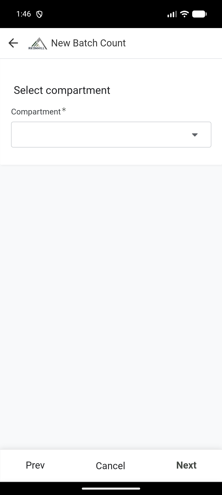
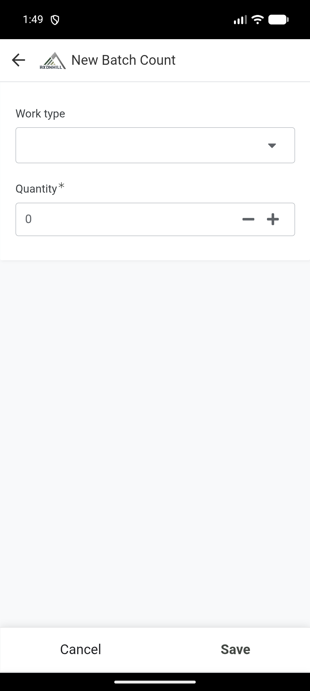

# Thumela ukubalwa kwe-batch

Kusalungiswa. Amakhasi efomu ahloliwe. Umphumela wokugcina osave-ile usadinga ukuhlolwa.

Sebenzisa **New Batch Count** uma uthumela i-crew eyodwa enama-work type nenani elilodwa noma amaningi.

## Ngaphambi kokuqala

Lungisa lokhu:

- i-team;
- i-compartment;
- i-Harvest Group;
- abantu abenze umsebenzi;
- i-work type ngayinye nenani layo;
- ama-note noma izithombe.

## Faka ukubalwa

1. Vula i-Field app.
2. Khetha **New Batch Count**.
3. Ku-**Select team**, khetha i-team efanele. Khetha **Next**.

4. Khetha i-compartment. Khetha **Next**.
5. Khetha i-Harvest Group. Khetha **Next**.
6. Hlola i-chainsaw operator, ama-marker nama-debarker abonisiwe.
7. Uma kusebenze omunye umuntu nge-chainsaw, khetha **Different Chainsaw Operator than on Harvest Group name?**, bese ukhetha lowo muntu.
8. Khetha **Next**.

## Faka ama-work type namanani

1. Ku-**Add work types and quantities**, khetha **New**.

2. Khetha i-work type.
3. Faka inani neminye imininingwane edingekayo.
4. Save-a lowo mugqa.
5. Faka omunye umugqa uma i-crew yenze olunye uhlobo lomsebenzi.
6. Hlola yonke imigqa, bese ukhetha **Next**.

Kufanele ufake okungenani i-work type eyodwa nenani layo.

## Faka ama-note nobufakazi

1. Faka i-note uma izosiza ihhovisi liqonde ukubalwa.
2. Ukufaka isithombe, khetha **New** ngaphansi kwezithombe, bese ufaka isithombe esifanele.
3. Hlola indawo uma ibonisiwe.
4. Khetha **Next** noma **Save**, njengoba kubonisiwe.

## Qinisekisa ngaphambi kokugcina

1. Funda amagama abasebenzi, ama-work type namanani abonisiwe.
2. Cela umsebenzi aqinisekise ukuthi kulungile.
3. Khetha impendulo **Y** kuphela uma konke kulungile.
4. Faka i-signature yomuntu oqinisekisayo uma idingeka.
5. Khetha **Save** kanye kuphela.
6. Gcina uhlelo luvulekile ngesikhathi luvumelanisa futhi lucubungula i-batch.

## Hlola umphumela

Vula **My Recent Batches**. I-batch ingaqala ibonise **Draft** noma **Processing**. Kufanele ishintshe ibe **Completed** uma i-automation isiqedile.

Uma ibonisa **Rejected** noma **Error**, yivule ufunde umlayezo ngaphambi kokuzama futhi.
