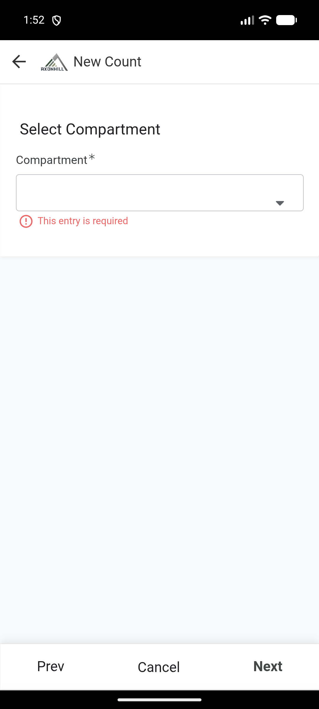
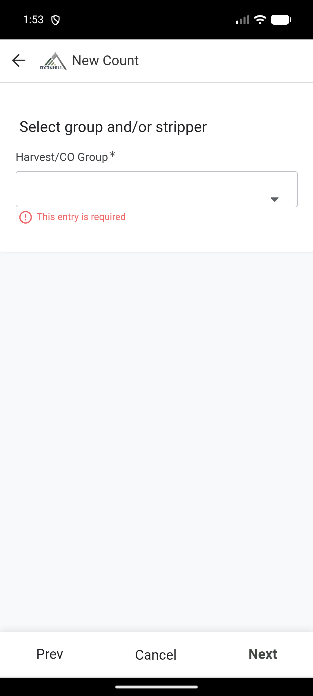

# Thumela ukubalwa komsebenzi

Kusalungiswa. Ukubalwa kokuhlola kugcinwe ngo-20 Agasti 2026, kodwa akuphelanga ngoba i-work type ibingenalutho.

Sebenzisa **New Count** ukufaka i-work type eyodwa nenani layo le-Team, i-Compartment ne-Harvest Group ekhethiwe.

!!! warning "Ungagcini ngaphandle kwe-work type"
    Ifomu yamanje ingabonisa i-Quantity ngaphandle kwenkambu ye-Work type. Uma ungakwazi ukubona nokukhetha i-work type, khansela ukubalwa ubikele ihhovisi. Uma ukugcina, ukubalwa kuzohlala kulindile futhi ama-Worklog ngeke adalwe.

## Ngaphambi kokuqala

Lungisa lokhu:

- i-Team;
- i-Compartment;
- i-Harvest Group;
- abantu abenze umsebenzi;
- i-work type nenani;
- ama-note noma izithombe zobufakazi.

## Faka ukubalwa

1. Vula i-Field app.
2. Khetha **New Count**.
3. Ekhasini le-Team, khetha i-Team efanele. Khetha **Next**.

4. Khetha i-Compartment efanele. Khetha **Next**.

5. Ku-**Select group and/or stripper**, khetha i-Harvest Group.

6. Hlola i-chainsaw operator, ama-marker ne-debarker abonisiwe.
7. Uma kusebenze omunye umuntu nge-chainsaw, khetha **Different Chainsaw Operator than on Harvest Group name?**, bese ukhetha lowo muntu.
8. Khetha **Next**.

## Faka umsebenzi nenani

1. Khetha i-work type.
2. Faka inani neminye imininingwane edingekayo.
3. Hlola i-unit of measure.
4. Khetha **Next**.

## Faka ama-note nobufakazi

1. Faka i-note uma izosiza ihhovisi liqonde ukubalwa.
2. Ukufaka isithombe, khetha **New** ngaphansi kwezithombe, bese ufaka isithombe esifanele.
3. Hlola indawo uma ibonisiwe.
4. Khetha **Next**.

## Qinisekisa bese ugcina

1. Funda amagama abasebenzi, i-work type nenani elibonisiwe.
2. Cela umsebenzi aqinisekise ukuthi kulungile.
3. Khetha impendulo **Y** kuphela uma konke kulungile.
4. Faka i-signature yomuntu oqinisekisayo uma idingeka.
5. Khetha **Save** kanye kuphela.
6. Gcina uhlelo luvulekile luze luqede uku-sync-a.

## Hlola umphumela

Vula **My Recent Entries**, bese ukhetha ukubalwa okusha. Hlola i-Team, i-Compartment, i-Harvest Group, abantu, i-work type nenani.

Uma i-work type ingenalutho, ukucutshungulwa kuhlala ku-Pending noma kubuye i-error. Ungathumeli ikhophi yesibili. Bika ukubalwa ne-ID yalo ehhovisi.
