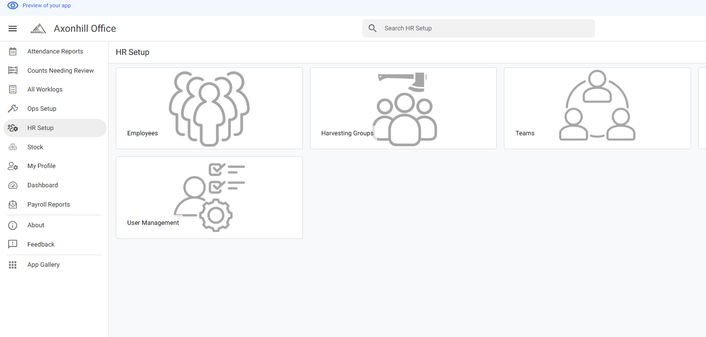

# Shintsha umsebenzi welungu le-Harvest Group

Lo mzila uhlolwe ngokushintsha umsebenzi kusuka ku-Marker kuya ku-Debarker nge-Harvest Group yokuhlola ehlukile ngomhlaka 19 Agasti 2026. Umbhalo wesiZulu uvulekele impendulo yabasebenzisi.

Sebenzisa lokhu uma ilungu elikhona le-Harvest Group kufanele lenze omunye umsebenzi.

## Izinyathelo

1. Vula i-Office app.
2. Vula **HR Setup**.
3. Vula **Harvesting Groups**.
4. Vula i-group efanele.
5. Ku-**Members**, vula umugqa womsebenzi ofanele.
6. Khetha **Edit Member(s)**.
7. Hlola ukuthi **Request Type** ithi **Change Harvest Group Role**.
8. Hlola umsebenzi, i-Harvest Group nomsebenzi wakhe wamanje.
9. Ku-**With this role**, khetha umsebenzi omusha.
10. Khetha usuku ushintsho oluqala ngalo.
11. Faka i-note emfushane uma idingeka.
12. Khetha **Save** kanye kuphela.

## Hlola umphumela

1. Linda uhlelo luvumelanise.
2. Vula i-Harvest Group futhi.
3. Hlola ukuthi ubulungu bamanje bomsebenzi bubonisa umsebenzi omusha.

Vula **Full membership history** uma ufuna ukuqinisekisa ushintsho. Umsebenzi omdala uhlala njengomugqa ophelile, futhi umsebenzi omusha ubonakala usebenza.

Uma umsebenzi omdala nomusha kubonakala kusebenza kokubili, ungenzi enye i-request. Bika kumlawuli wohlelo.
