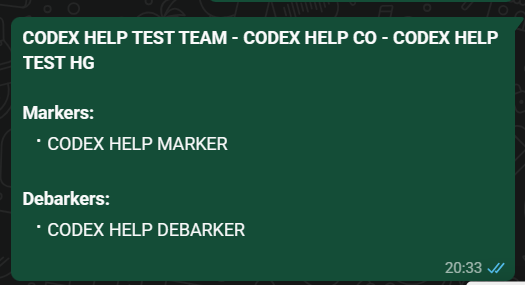

# Yabelana ngesifinyezo se-Harvest Group

Kusalungiswa. Inkinobho, umbhalo nokubukeka kokugcina ku-WhatsApp kuhlolwe ngamagama e-Codex kuphela. Ukusuka ngqo ku-app ukuya ku-WhatsApp kusadinga ukuhlolwa kokugcina.

Sebenzisa lokhu ukuthumela abantu abakhona ku-Harvest Group ku-WhatsApp group yomsebenzi ukuze bahlolwe.

## Izinyathelo

1. Vula i-Office app.
2. Vula **HR Setup**.
3. Vula **Harvesting Groups**.
4. Vula i-group efanele.
5. Khetha **Share WhatsApp Summary**.
6. Linda i-WhatsApp ivuleke.
7. Funda wonke umlayezo ngaphambi kokuwuthumela.
8. Khetha i-WhatsApp group efanele.
9. Thumela kuphela uma i-Harvest Group namagama abasebenzi kulungile.

## Okuqukethwe umlayezo

Isihloko sokuqala sibonisa i-Team ne-Chainsaw Operator. Umlayezo ube usubala:

- ama-**Markers**;
- ama-**Debarkers**.

Kufanele kubonakale amalungu akhona futhi asebenzayo kuphela.

Uma kuvela umuntu omdala noma ongasasebenzi kule group, ungawuthumeli umlayezo njengokuqinisekisa. Qala ubike ubulungu obungalungile.
