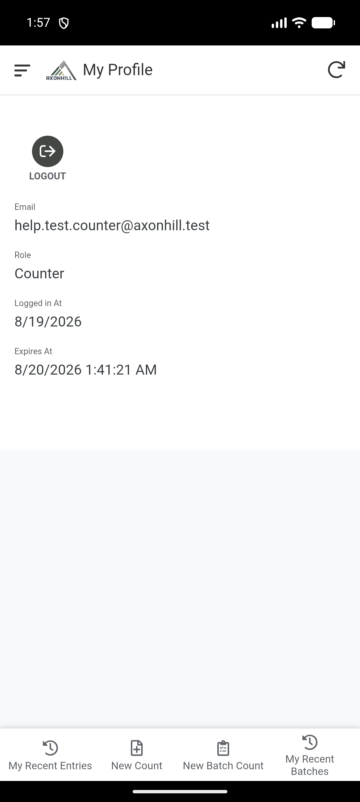

# Shintsha i-password noma uphume

Kusalungiswa. Ukuphuma ku-Field app ne-configuration yokushintsha i-password ku-Office kuhloliwe. Umphumela omusha wokushintsha i-password usadinga ukuhlolwa.

## Phuma ku-Field app

1. Vula i-menu ye-Field app.
2. Vula **My Profile**.
3. Khetha **Logout**.
4. Hlola ukuthi **Field Login** iyavuleka.

Phuma uma omunye umuntu ezosebenzisa idivayisi efanayo.

## Phuma ku-Office app

1. Vula **My Profile**.
2. Khetha **Log Out**.
3. Hlola ukuthi **Office Login** iyavuleka.

## Shintsha i-password yakho ye-Office

1. Vula **My Profile** ku-Office app.
2. Khetha **Change Password**.
3. Faka i-**Current Password**.
4. Faka i-**New Password** enezinhlamvu okungenani eziyisishiyagalombili.
5. Faka i-password efanayo ku-**Confirm New Password**.
6. Khetha **Save** kanye kuphela.
7. Linda umphumela ubonise **Success**.

Sebenzisa i-password entsha uma ungena futhi.

| Okubonayo | Okufanele ukwenze |
|---|---|
| **Password must be at least 8 characters.** | Faka i-password entsha ende. |
| **Passwords do not match.** | Faka i-password entsha efanayo kuzo zombili izindawo. |
| Umphumela uhlala uthi **Pending** | Yenza i-sync bese ulinda umphumela ngaphambi kokuzama futhi. |
| Awuyazi i-password yamanje | Cela i-Admin noma umuntu wase-Office ayisethe kabusha. |
