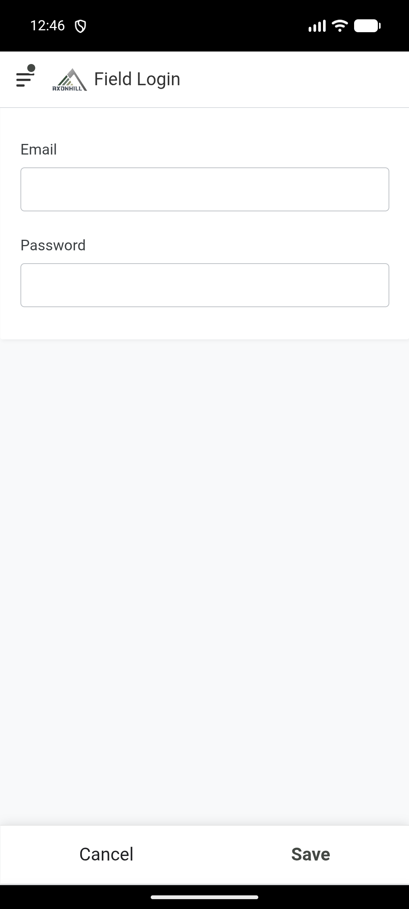

# Ngena bese uvumelanisa

Kusalungiswa. I-Field Login ihloliwe. Ukuhlolwa kokugcina kwe-Office nokuphuma kusadingeka.

## Ngena

1. Vula uhlelo lwe-AxonHill olufanele.
2. Ku-**Field Login** noma **Office Login**, faka i-email yakho yomsebenzi.
3. Faka i-password yakho yohlelo.
4. Khetha **Save**.
5. Linda ikhasi lokuqala livuleke.

Ungasebenzisi i-account yomunye umsebenzi. Umsebenzi wakho unquma lokho okuboniswa uhlelo.

## Vumelanisa uhlelo

1. Qinisekisa ukuthi ifoni noma ikhompyutha ine-internet.
2. Khetha uphawu lwe-AppSheet sync.
3. Linda uphawu lwe-sync luyeke ukuhamba.
4. Bheka ukuthi uhlelo lubonisa imininingwane yakamuva.

Ungaluvali uhlelo ngesikhathi lusavumelanisa.

## Uma lungaqedi

Yiya ku-[Uhlelo aluvuleki noma aluvumelanisi](../fix-a-problem/app-will-not-open-or-sync.md).
